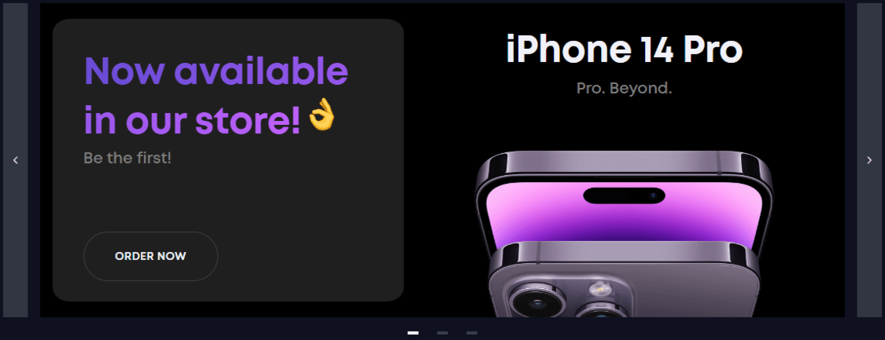

# 👍 Nice Gadgets - Modern React Marketplace

High-performance e-commerce web application built with React, Redux Toolkit, and TypeScript. This project focuses on delivering a seamless shopping experience with robust global state management, strict type safety, dynamic routing, and a clean, responsive UI.

## 🎯 Demo Showcase



## 🚀 Live Demo
**Check it**: [NiceShop](https://yahohulia.github.io/NiceShop/)

## 💎 Design Accuracy

Developed with **100% adherence** to the provided design specifications. The application serves as a pixel-perfect implementation of the original UI/UX guidelines, demonstrating strong attention to detail and CSS architecture.

🔗 **[Check out the Figma / Original Design](https://www.figma.com/design/BUusqCIMAWALqfBahnyIiH/Phone-catalog--V2--Original-Dark?node-id=15875-34069&t=XcoQMe6JSUsI1zdc-1)**

## 🏅 Features

- **Global State Management** - Fully functional Shopping Cart and Favorites system powered by **Redux Toolkit** for efficient state updates and real-time price calculation across the app.
- **Dynamic Routing** - Seamless navigation between Home, Phones, Tablets, and Accessories using **React Router DOM**.
- **Dark/Light Theme Switcher** - Built-in toggle allowing users to seamlessly switch between visual themes, enhancing accessibility and providing a personalized browsing experience.
- **Advanced Filtering & Sorting** - Real-time product sorting (by price, age, or name) and pagination for a smooth browsing experience.
- **Modern Styling Architecture** - Responsive, pixel-perfect layouts crafted with **Bulma**, custom **SCSS**, and the **BEM** methodology.
- **Type-Safe Development** - Extensive use of **TypeScript** interfaces for product data, component props, and Redux slices to ensure build-time reliability.
- **High Code Quality** - The project strictly follows the **Airbnb TypeScript style guide** with robust ESLint and Stylelint configurations, formatted via Prettier.
- **Testing Ready** - Configured with **Cypress** for reliable End-to-End and component testing.

## 💻 Tech Stack


## 🪄 Installation & Setup

### Clone the repository:
```bash
  git clone [https://github.com/yahohulia/NiceShop.git](https://github.com/yahohulia/NiceShop.git)
  cd NiceShop
```
### Install dependencies:
```bash
  npm install
    # or
  yarn install
```
### Build the project
```bash
  npm run build
    # or
  yarn run build
```
### Run the project locally:
```bash
  npm start
    # or
  yarn start
```

